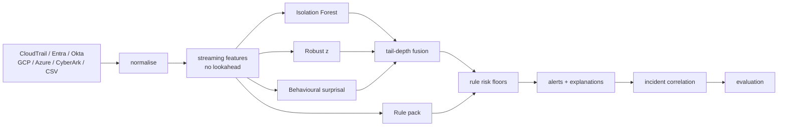

# ARGUS — Identity Threat Detection Console

**[▶ Open the console](https://keyfive5.github.io/AI-Driven-IAM-Anomaly-Detection/)** ·
[run the test suite in your browser](https://keyfive5.github.io/AI-Driven-IAM-Anomaly-Detection/tests.html) ·
[how the engine works](https://keyfive5.github.io/AI-Driven-IAM-Anomaly-Detection/#engine)

A complete rebuild of my 2025 university IAM anomaly-detection project as something that could
actually sit in front of an analyst: it ingests real cloud identity logs, scores every event with an
ensemble of unsupervised detectors plus a MITRE-mapped rule pack, explains each finding in plain
language, correlates alerts into incidents along the kill chain, and then **grades itself on
labelled data in front of you**.

It runs entirely in the browser. No install, no build step, no dependencies, no server — an audit
log full of principal names and source addresses is exactly the kind of data that should never be
uploaded to someone else's compute in exchange for a demo.

The original project is preserved untouched in [`src/`](src), [`tests/`](tests) and
[`ORIGINAL_README.md`](ORIGINAL_README.md). Nothing here overwrites it.

---

## Why rebuild it

The original works, and for a group course project it did what it needed to. Reading it back a year
later, four things stood out — and each one is a lesson worth more than the code:

| The original | The problem | What ARGUS does |
|---|---|---|
| `PROJECT_DOCUMENTATION.md` quotes precision 0.89 / recall 0.92 for the hybrid model | Nothing in the repository computes those numbers, and nothing could — the pipeline never held a labelled test set | Every metric is recomputed live from labelled data, with the seed printed beside it and a [reproducible benchmark](web/tests/benchmark.mjs) in the repo |
| Feature engineering computed group statistics over the whole DataFrame | Each event was scored using events from its own future. Any metric measured this way is inflated by information a live detector would not have | Strictly streaming: event *i* is scored from events 0..*i*−1 only, and a [test asserts it](web/tests/tests.js) by truncating the stream and checking earlier features are unchanged |
| The synthetic generator emitted uniformly random events | "Anomaly" becomes trivially separable, so good scores mean nothing | A structured estate — roles, working hours, task sequences, service accounts — plus deliberate benign confusers that cost precision on purpose |
| A Random Forest trained on labels produced by the Isolation Forest | It can only learn to imitate the model that labelled it; it adds no independent information | Three genuinely independent detectors, combined by tail-depth, plus a rule pack for known-bad |

---

## What it does

**Ingests** AWS CloudTrail, Microsoft Entra ID sign-ins, Okta System Log, Google Cloud audit logs,
Azure Activity logs, CyberArk PAM exports, and generic JSON/JSONL/CSV — format detected from the
record shape, vendor verbs canonicalised so one rule pack covers every source.

**Scores** every event 0–100 on a tail-percentile scale, with three detectors and ~35 behavioural
features built from each identity's own history.

**Explains** every alert: which features drove it and by how many robust standard deviations, which
rules fired with their ATT&CK technique, and how much each detector contributed.

**Correlates** alerts into incidents by identity and contiguous time, ordered along the kill chain,
linked when they share a source address, with a copy-paste ticket summary and suggested next steps.

**Grades itself** — ROC/PR curves, a live threshold slider, a detector ablation, and per-campaign
time-to-detect, all recomputed in the page.

**Tunes** — mute a rule for one identity the way a real SOC does; mutes apply after scoring, so
nothing re-runs and nothing is lost.

---

## Results

Five seeded corpora, ~105,000 events, 599 malicious events (0.57%), eight injected multi-stage
campaigns per run. Reproduce with:

```bash
node web/tests/benchmark.mjs
```

| Configuration | ROC AUC | Avg precision | F1 | Precision | Recall | Alerts / 1k |
|---|---|---|---|---|---|---|
| Isolation Forest alone | 0.994 | 0.811 | 0.784 | 80.1% | 77.4% | 5.5 |
| Robust z alone | 0.986 | 0.457 | 0.502 | 49.0% | 52.8% | 6.3 |
| Behavioural model alone | 0.649 | 0.106 | 0.234 | 23.5% | 23.8% | 6.2 |
| Rules alone | 0.697 | 0.346 | 0.471 | 65.5% | 37.9% | 3.8 |
| Ensemble (models only) | 0.997 | 0.813 | 0.778 | 76.6% | 79.4% | 5.9 |
| **ARGUS (ensemble + rules)** | **0.997** | 0.782 | 0.735 | 66.4% | **82.4%** | 7.2 |

**40 of 40 campaign instances detected**, most within seconds of their first event.

Read that table honestly: the models alone score *higher* on average precision. The rule pack trades
some precision for recall and for coverage the models cannot provide — the `insider_admin` campaign
(an identity administrator quietly attaching `AdministratorAccess` to a backdoor user, at 14:00,
from their usual address, on an MFA session, using an operation they perform weekly) was caught by
**rules only in 3 of 5 runs**. There is nothing behaviourally unusual about it. That is the case
signature detection exists for, and an ensemble judged on average precision alone would delete the
component that catches it.

The one number that transfers to a real estate is the **alert budget**: ~7 alerts per 1,000 events
is a workload claim, and it holds whether or not the labels are right.

---

## How it works



### Three detectors, because each is blind to what the others see

- **Isolation Forest** — joint weirdness across all features. Written from scratch, including the
  split-path attribution that tells each alert which axes isolated it.
- **Robust z** — a single axis that is simply extreme. Median and MAD, so the estimate is not
  dragged around by the very outliers it is meant to find.
- **Behavioural surprisal** — a per-identity Markov chain over operations, plus operation and hour
  surprisal against that identity's own history. This replaces the original's LSTM: no training, it
  updates online, and its output reads directly as "how unexpected was this step".

### Risk is a tail percentile, not a probability

```
p = 1 − rank                    share of events at least this odd
risk = 100 · log₁₀(1/p) / 3.5
```

So risk 57 ≈ the oddest 1% of events and risk 86 ≈ the oddest 0.1% — and it means the same thing on
a 2,000-event corpus as on a 200,000-event one. A threshold is then a statement about analyst
capacity, which is the only honest basis for choosing one.

### Rules assert a floor, never a cap

Unsupervised models find *unusual*; rules encode *known-bad*. `cloudtrail:StopLogging` is not
statistically interesting in an estate where nobody has ever done it — it is simply an emergency.
Broad-surface rules fire on **circumstances**, never on the verb alone: an identity administrator
creating a user at 11:00 from the office on an MFA session is doing their job; the same call at
03:00 from a new address is an incident.

---

## Five things that turned out to matter

Each of these was found by measurement, not by design instinct, and each is written up in the
source at the point where it applies.

**1. Averaging detectors is measurably wrong.** The obvious fusion — a weighted mean of normalised
ranks — was the first implementation. Rare-event detection wants *"did anyone see something"*, not
*"did everyone agree"*: a detector putting an event in its top 0.1% is making a strong claim, and
averaging it against two detectors that shrug destroys it. Switching to weighted **tail-max** moved
average precision from 0.50 to 0.85 and recall at the default threshold from 0.58 to 0.92, at the
same alert budget. ([`score.js`](web/core/score.js))

**2. A rule that fires on a verb will be switched off within a week.** The first rule pack produced
**158 alerts per 1,000 events** — mostly identity administrators doing their jobs. Conditioning
broad rules on circumstances, grading the risk floor by how much is actually odd, and suppressing
rules for operations an identity performs routinely brought it to ~7 per 1,000 while *raising*
precision. ([`rules.js`](web/core/rules.js))

**3. One misconfigured identity can flood the queue.** An identity with MFA permanently off scored a
suspicion bump on every single event it produced. MFA absence is a *posture* problem, reported on
the identity's profile; the *anomaly* is the drop-off — an identity that normally presents a second
factor suddenly not doing so. ([`features.js`](web/core/features.js))

**4. Impossible travel needs to know what a location fix is.** Computing velocity between
consecutive events flagged people whose laptop and CI job acted in the same minute. A request's
source address tells you where the *request* came from; only an authentication event tells you where
the *person* is. ([`features.js`](web/core/features.js))

**5. Stored settings are an API.** Detector weights changed meaning from mixing proportions to trust
factors. A browser holding the old values ran a badly mis-scaled engine, and every metric on screen
was wrong with nothing to indicate why. Persisted state now carries a schema version.
([`state.js`](web/ui/state.js))

There is also a plain bug worth recording: the generator anchored days to `Date.now()` rather than
midnight, so every persona's "9am" landed at whatever hour the corpus happened to be generated. The
diurnal structure the off-hours rules depend on simply was not there. Fixing it cut off-hours rule
firings by two thirds and more than doubled their true-positive rate.

---

## Running it

Nothing to install — **[open the console](https://keyfive5.github.io/AI-Driven-IAM-Anomaly-Detection/)**.
It generates a labelled estate and analyses it on load; drop your own export on the Data tab to
analyse that instead.

Locally, any static file server works (ES modules need HTTP, not `file://`):

```bash
python -m http.server 4178 --directory web
```

Tests and benchmark run in Node with no dependencies:

```bash
node web/tests/run.mjs
```

```bash
node web/tests/benchmark.mjs
```

The suite also runs in the browser at [`tests.html`](https://keyfive5.github.io/AI-Driven-IAM-Anomaly-Detection/tests.html) — 31 tests covering parser fidelity, the
no-lookahead guarantee, Isolation Forest ordering and determinism, risk-scale calibration, and the
metric implementations checked against hand-computed values.

**Keyboard:** `1`–`7` switch views, `/` jumps to alert search.

---

## Repository layout

```
web/                    the rebuild
  core/                 detection engine — no DOM, runs under Node too
    parse.js            six log formats + generic CSV/JSONL, format sniffing
    generate.js         synthetic estate with labelled multi-stage campaigns
    features.js         streaming feature extraction and identity baselines
    iforest.js          Isolation Forest with split-path attribution
    stats.js            robust statistics and rank normalisation
    rules.js            MITRE-mapped detection rules
    score.js            tail-depth fusion, risk scale, explanations
    incidents.js        alert correlation
    evaluate.js         ROC, PR, ablation, campaign detection
    pipeline.js         orchestration
  ui/                   console — views are pure render(state) → html
  data/                 sample corpora in vendor shapes
  tests/                test suite + reproducible benchmark

src/                    ORIGINAL 2025 project, unchanged
tests/                  ORIGINAL unit tests, unchanged
data/                   ORIGINAL sample logs, unchanged
report.tex              ORIGINAL IEEE write-up
ORIGINAL_README.md      ORIGINAL readme
```

The engine has no DOM dependencies, so every module in `web/core/` imports cleanly into Node —
which is how the benchmark and tests run.

---

## Limitations

- **The synthetic metrics describe a synthetic estate.** The generator was written alongside the
  detector, so it inevitably encodes some of the same assumptions about what "normal" looks like.
  Treat the absolute values as an upper bound and the *ordering* of the ablation as the result.
- **Behavioural detection needs history.** On a small export, every operation is "the first time this
  identity has done this". The console detects this case and says so rather than letting the alert
  rate be read as a finding.
- **Geography is only as good as the source.** CloudTrail carries no location, so region is mapped to
  a coarse centroid; impossible travel is only meaningful on sources that report where a sign-in
  happened.
- **Times are UTC.** Business hours are 07:00–19:00 UTC; a per-identity timezone would be the right
  next step for a genuinely global estate.
- **Nothing here is a SIEM.** There is no ingestion pipeline, no retention, no alerting integration.
  It is a detection engine and a triage surface, and it is honest about which.

---

## Licence

MIT — see [LICENSE](LICENSE). Original project by Group 18, University of Guelph, 2025.
